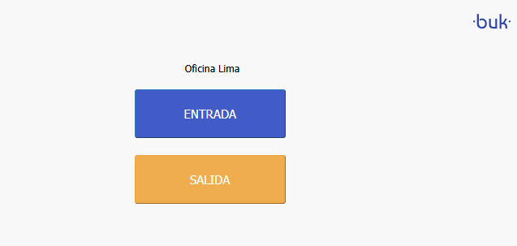

# auto-dialer

An automated dialer system using Puppeteer and cron jobs. This project automates the process of marking entry and exit times on a Buk Register.



## Installation

To install dependencies system-wide:

```bash
sudo apt-get update
sudo apt-get install -y chromium-browser
```

To install dependencies project-wide:

```bash
bun install
```

## Configuration

Environment variables can be set in a `.env` file at the root of the project. Example:

```env
DNI_NUMBER=99999999
DIAL_URL=https://app.ctrlit.cl/ctrl/dial/web/KqpFkRElr7
CHROMIUM_PATH=/usr/bin/chromium-browser
SCHEDULE_ENTRY="0 8 * * *,0 14 * * *"                    # At 08:00 and 14:00 every day
SCHEDULE_EXIT="0 13 * * *,0 18 * * *"                    # At 13:00 and 18:00 every day
```

## Usage

To run:

```bash
bun run dev # for development with watch mode
bun run start # for production
```

## License

This project is licensed under the MIT License – see the [LICENSE](LICENSE) file for details.
